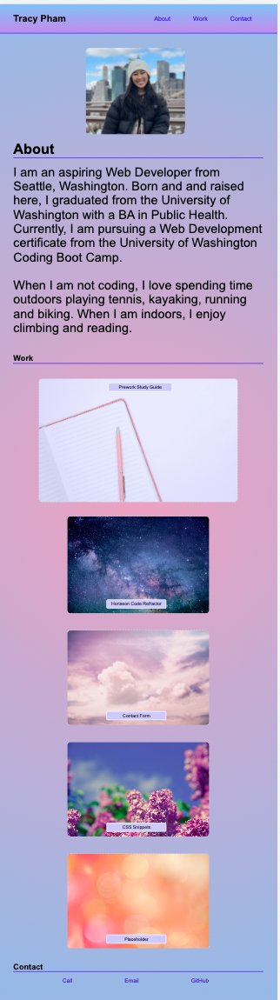

# professional-portfolio

## Description

This project was created to showcase my professional portfolio as an aspiring Web Developer. With this webpage, I am able to introduce myself and my work for potential employers, who can then contact me for more information. This webpage was created to set up my success for future endeavors and employment.

This was done by creating a portfolio webpage with HTML and advanced CSS that is responsive, concise, and logically structured. This was achieved by using advanced CSS in the form of variables, pseudo-classes, relative positioning, media queries and flexboxes.

## Installation

N/A

## Usage

Visit the project website here: https://pham-tracy.github.io/professional-portfolio/.

This webpage is responsive so its appearance may change on various screen widths and devices.

## Credits

Stock photos were provided by pxhere.com.

## License

MIT license is used for this project. Please refer to the LICENSE file in the repository for more details.
